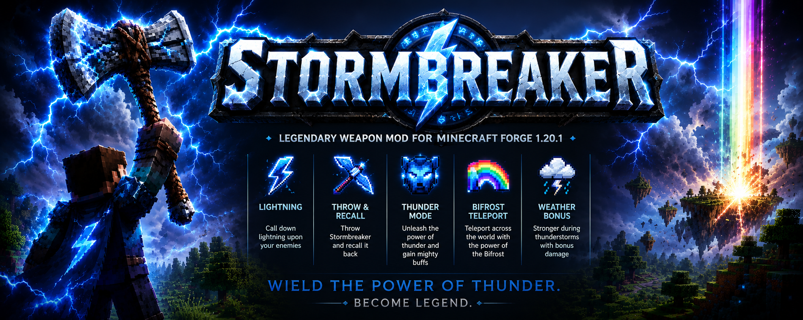
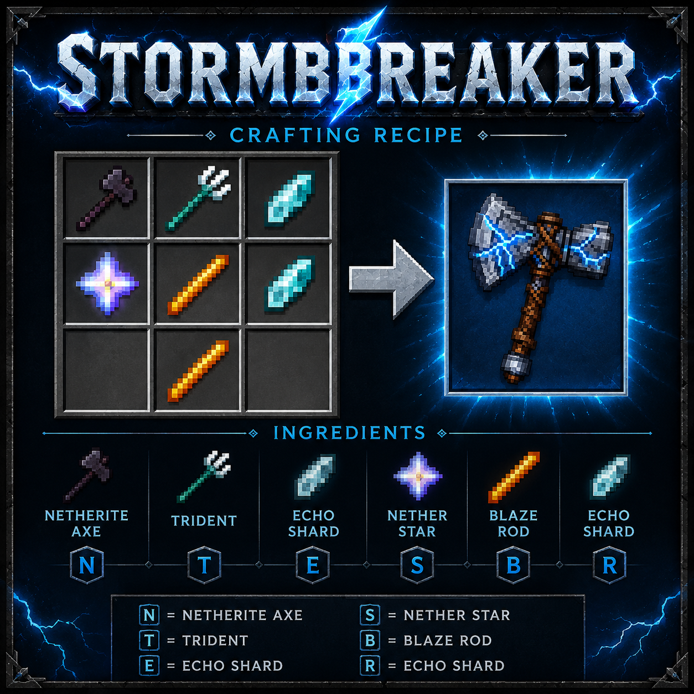

# Stormbreaker (Forge 1.20.1)



Legendary cinematic Stormbreaker weapon mod for Minecraft Forge `1.20.1` with GeckoLib-powered item animation, lightning abilities, throw/recall combat, Thunder Mode, and Bifrost teleport.

## Features

- Custom `Stormbreaker` weapon with:
  - Legendary rarity and fire resistance
  - Very high durability (`4500`)
  - GeckoLib animated idle model
- Abilities:
  - `Right-click`: call down lightning at your target
  - `Sneak + Right-click`: throw Stormbreaker as a projectile
  - `V`: activate Thunder Mode
  - `B`: cast Bifrost teleport
- Combat effects:
  - AoE lightning damage and explosions
  - Weather bonuses during thunderstorms
  - Thunder Mode aura with periodic lightning pulses
- Custom particles for electric and Bifrost visuals.

## Controls

Default keybinds:

- `V` -> Activate Thunder Mode
- `B` -> Cast Bifrost

## Crafting Recipe

Stormbreaker is crafted with this shaped recipe:



```text
N T E
S B R
  B
```

Where:

- `N` = Netherite Axe
- `T` = Trident
- `E` = Echo Shard
- `S` = Nether Star
- `B` = Blaze Rod
- `R` = Echo Shard

Recipe file: `src/main/resources/data/stormbreaker/recipes/stormbreaker.json`

## Configuration

Common config values are defined in:

- `src/main/java/com/stormbreaker/config/StormbreakerConfig.java`

Default highlights:

- `baseDamage`: `22.0`
- `lightningCooldownTicks`: `80`
- `throwCooldownTicks`: `30`
- `thunderModeDurationTicks`: `400`
- `thunderModeCooldownTicks`: `2400`
- `bifrostCooldownTicks`: `1800`
- `bifrostRange`: `96`
- `bifrostXpCost`: `3`
- `explosionRadius`: `2.5`
- `weatherLightningBonus`: `1.35`
- `weatherAttackBonus`: `1.20`

## Requirements

- Java `17`
- Minecraft Forge `1.20.1-47.3.0`
- GeckoLib Forge `4.4.9`

## Development

### Build

```bash
./gradlew build
```

### Run Client

```bash
./gradlew runClient
```

### Run Server

```bash
./gradlew runServer
```

## Project Info

- Mod ID: `stormbreaker`
- Name: `Stormbreaker`
- Version: `1.0.0`
- License: `MIT`
- Authors: `Ashutosh Swamy`

## Notes

- This project is configured for ForgeGradle 6 and official Mojang mappings for `1.20.1`.
- Resource assets live under `src/main/resources/assets/stormbreaker`.
